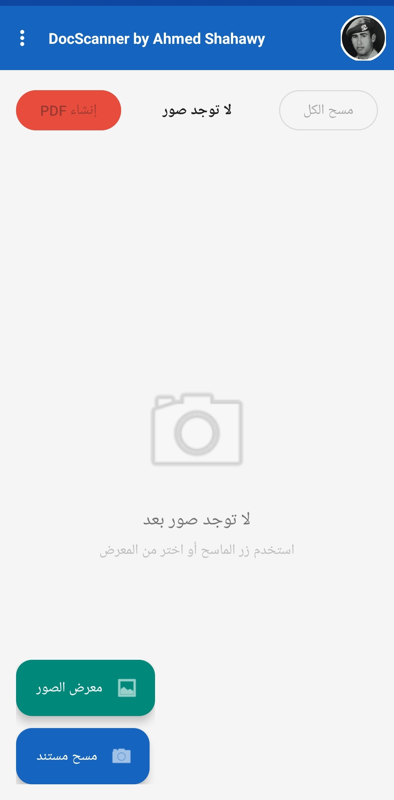
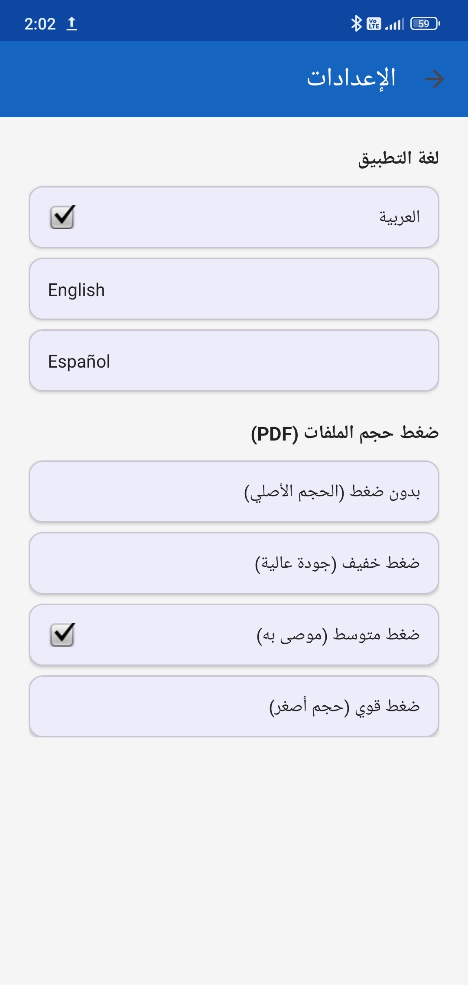

# 📄 DocScanner - تطبيق مسح المستندات

تطبيق Android مبني بـ **Kotlin** يتيح التقاط المستندات وتحويلها إلى PDF.

---


## ✨ الميزات

| الميزة | الوصف |
|--------|-------|
| 📸 تصوير متعدد | التقاط عدة صور لمستندات مختلفة |
| 🔲 اقتصاص تلقائي | كشف حواف المستند باستخدام Sobel Edge Detection |
| ✨ تحسين تلقائي | زيادة التباين والحدة لجعل النص أوضح |
| 📄 إنشاء PDF | دمج الصور في ملف PDF مضغوط |
| 📤 مشاركة | مشاركة الـ PDF عبر أي تطبيق |

---

## 📱 تدفق استخدام التطبيق

```
المستخدم يفتح التطبيق
        ↓
يضغط "التقاط صورة" → يُفتح شاشة الكاميرا
        ↓
يصوّر المستند → الصورة تُعاد للشاشة الرئيسية
        ↓
يكرر التصوير بقدر الحاجة
        ↓
يضغط "إنشاء PDF" → يُفتح شاشة المعاينة
        ↓
تُعالَج الصور تلقائياً (تحسين + اقتصاص)
        ↓
يضغط "إنشاء PDF" → يُنشأ ملف PDF
        ↓
يختار "مشاركة" أو "فتح"
```

---

## 🔧 شرح خوارزميات معالجة الصور

### 1. اقتصاص المستند (Auto-Crop)

```
الصورة الأصلية
      ↓
تحويل لرمادي (Grayscale)
      ↓
كشف الحواف بـ Sobel Operator
      ↓
إيجاد أبعاد المستند (min/max X, Y)
      ↓
اقتصاص مع هامش 2%
```

**Sobel Operator** هو مرشح رياضي يكشف التغيرات المفاجئة في الإضاءة (= الحواف):
```kotlin
// حساب التدرج الأفقي والرأسي
val gx = gray[i + 1] - gray[i - 1]   // أفقي
val gy = gray[i + width] - gray[i - width]  // رأسي
val edgeStrength = sqrt(gx² + gy²)
```

### 2. تحسين الصورة (Enhancement)

**أ. ColorMatrix - تحسين التباين:**
```kotlin
val contrast = 1.3f    // زيادة 30%
val brightness = -20f  // تعتيم طفيف لإبراز النص

ColorMatrix(floatArrayOf(
    contrast, 0, 0, 0, brightness,  // Red
    0, contrast, 0, 0, brightness,  // Green
    0, 0, contrast, 0, brightness,  // Blue
    0, 0, 0, 1, 0                   // Alpha
))
```

**ب. Sharpening Kernel - تحسين الحدة:**
```
النواة المستخدمة:
 0  -1   0
-1   5  -1
 0  -1   0

كيف تعمل: تضاعف قيمة البكسل المركزي × 5
وتطرح منه قيم الجيران → يبرز الحواف والتفاصيل الدقيقة
```

---

## ⚠️ مشاكل شائعة وحلولها

| المشكلة | السبب | الحل |
|---------|-------|------|
| `Gradle sync failed` | مشكلة في الإنترنت أو الإصدارات | `File → Invalidate Caches → Restart` |
| الكاميرا لا تفتح | نقص الصلاحية | تأكد من قبول صلاحية الكاميرا |
| `ClassNotFoundException: iTextPDF` | الحجم الكبير للمكتبة | أضف `multiDexEnabled true` في build.gradle |
| الـ PDF فارغ | مسار الصورة خاطئ | تحقق من صلاحيات التخزين |

### حل مشكلة MultiDex
```groovy
// في app/build.gradle داخل defaultConfig
defaultConfig {
    ...
    multiDexEnabled true
}

// في dependencies
implementation 'androidx.multidex:multidex:2.0.1'
```

---

## 🚀 تحسينات مستقبلية مقترحة

1. **OCR (تحويل الصورة لنص):**
   
3. **ترتيب الصور بالسحب والإفلات** 

4. **اسم مخصص للـ PDF** - إضافة حقل نص قبل الإنشاء

5. **Google Drive Integration** - رفع الـ PDF مباشرة للسحابة

---

